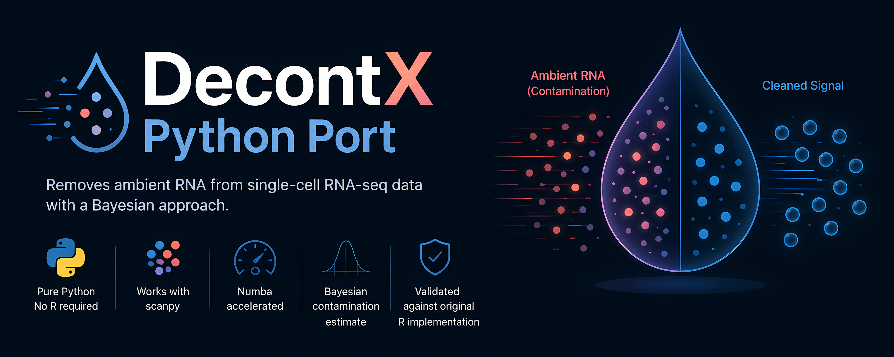

# DecontX Python Port


DecontX removes ambient RNA from single-cell RNA-seq data. This Python port directly works with scanpy.

## Overview

DecontX is a Bayesian method. It estimates and removes cross-contamination from ambient RNA in droplet-based single-cell RNA-seq data. This Python implementation agrees with the original R version. The correlation is > 0.999.

**Key Features:**
- Pure Python. You do not need R.
- Works with scanpy.
- Numba accelerates performance.
- Bayesian contamination estimate for each cell.
- Validated against the original R implementation.

## What's New

This fork rewrites the original Python port. It focuses on R parity, performance, and reliability.

- **Sparse, CSR-aligned EM.** Native counts stay in a 1D array. This array aligns with the input CSR pattern. The EM loop does not densify data. The new code is faster than the original dense implementation. **For 500 × 500 data, the speedup is 12×. For 10,000 × 5,000 data, the speedup is 134×.** For 5,000 × 3,000 data at 8% density, the runtime is 0.11 s. The original dense implementation needs 12.8 s.
- **R parity to ~7e-16.** Contamination, theta, phi, eta, and counts agree with an independent transcription of `DecontX.cpp`. The correlation is > 0.999.
- **R-correct theta, contamination, and delta.** The code uses the posterior mean for theta. It uses the E-step proportion for contamination. It keeps counts as fractional values. It fits delta with Minka’s fixed-point Dirichlet MLE.
- **Multi-batch fixes.** Cluster labels are safe to remap for each batch. NaN batch labels raise an error. The batch name `"all"` does not collide with the single-batch sentinel. Each batch gets its own seed.
- **Performance options.** You can use lazy Numba JIT compilation, `compute_log_likelihood=False`, `dtype="float32"`, and `round_counts`.
- **Cleaner metadata and dead-code removal.** `uns['decontX']` is split into `parameters` and `fitted`. Approximately 700 lines of dead code were removed.

For the full list of changes and acknowledgments, see [CHANGELOG.md](CHANGELOG.md).

## Installation

### Latest version from GitHub

```bash
pip install git+https://github.com/NiRuff/decontx-python.git
```

This command installs the current `main` branch. Use it when you need the newest changes. For more information about performance and `compute_log_likelihood`, see [PERFORMANCE.md](PERFORMANCE.md).

For development install instructions and test instructions, see [CONTRIBUTING.md](CONTRIBUTING.md).

## Quickstart

```python
import decontx

decontx.decontx(adata, cluster_key="leiden")
```

The function changes `adata` in place. Set `copy=True` to get a copy. For the full API, see [API.md](API.md). For how to use it in a scanpy pipeline, see [WORKFLOW.md](WORKFLOW.md).

# Validation: R vs Python Implementation

Parity is enforced by the test suite, not asserted. `tests/r_reference.py` is an independent transcription of celda's `src/DecontX.cpp`. It uses dense numpy. It shares no code with `decontx/`. The test `test_r_parity_gate` runs the current implementation against it on every test run.

| | max absolute error vs R reference | correlation |
|---|---|---|
| float64 (default) | 7.2e-16 | 1.000000000 |
| float32 | 2.4e-08 | 1.000000000 |

The remaining float64 difference is a documented one-E-step offset. R reports contamination from the E-step at the start of its final iteration. Its reported contamination corresponds to a different E-step than its reported counts. DecontX Python runs one more E-step with the converged parameters. The extra E-step keeps contamination consistent with the returned counts. The agreement is 5e-16. If you align that step, the two implementations match to 7.2e-16. The test `test_r_parity_is_exact_modulo_final_estep` pins this at 1e-10.

Reproduce it yourself:

```bash
pytest tests/test_regression.py -k parity -v
```

## Real-data comparison


**PBMC 3K dataset results:**
- **Correlation: 0.999** between the R and Python implementations
- **Mean absolute error: <1%** across all parameter settings
- **Identical statistical properties** (mean, std, range)
- **Per-cluster consistency** across cell types

The figure above predates the R-parity corrections described above. We have not regenerated it since. The measurements in the table are the current, reproducible numbers. For reference, the pre-correction implementation scored 0.9815 against the transcription above. That score was below the >0.999 bar the project sets for itself. That gap prompted the fixes.


## Documentation

- [API reference](API.md)
- [Workflow guide](WORKFLOW.md)
- [Performance tips](PERFORMANCE.md)
- [Method comparison](METHODS.md)
- [Changelog](CHANGELOG.md)
- [Contributing and development](CONTRIBUTING.md)

## Citation

If you use DecontX in your research, please cite:

> Yang, S., Corbett, S.E., Koga, Y. et al. Decontamination of ambient RNA in single-cell RNA-seq with DecontX. Genome Biol 21, 57 (2020). https://doi.org/10.1186/s13059-020-1950-6

## License

MIT License
